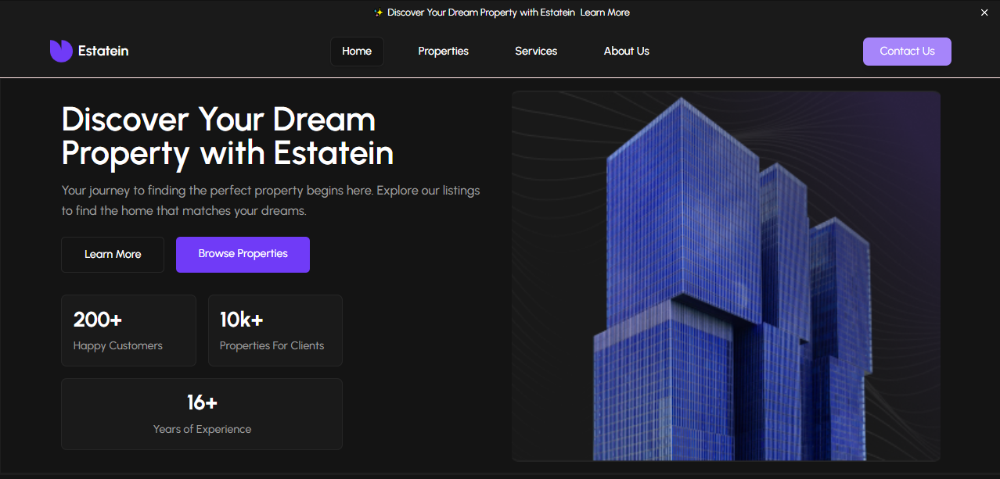

# 🏠 Real Estate Listing Platform – Frontend Build

## 🧩 The Problem  
Agents and property seekers struggled with outdated, slow, and cluttered platforms. The client needed a fast, responsive UI to handle rich property data with seamless search and filtering.

## 🚀 The Solution  
I built a **fast, responsive frontend** using **React.js** and **Tailwind CSS**, featuring a clean UI, advanced search and filter options, and optimized components for handling rich property data across all devices.

### ✅ Features Include:
- Optimized property cards  
- Advanced search & filters  
- Mobile-first responsive layout  
- Lazy-loaded images  
- Clean, intuitive UI  

Built with **React**, **TypeScript**, and **Tailwind CSS**, the goal was **clarity, speed, and a smooth user experience**.

## 📚 What I Learned  
Building data-rich UIs taught me how to prioritize **structure, reusability, and speed** — especially when working with **media-heavy content** and **complex filters**.

## 🔗 https://estain.netlify.app/

---

## 🏷 Tags  
#ReactJS  
#WebDesign  
#ThreeJS  
#CreativeCoding  
#BuildInPublic  
#FrontendDevelop  
#TailwindCSS  
#RealEstateTech  
#UXDesign
